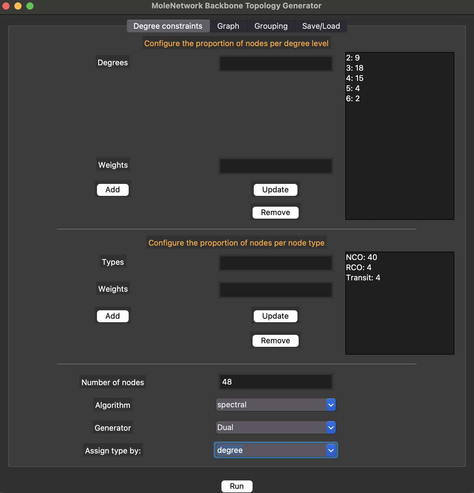
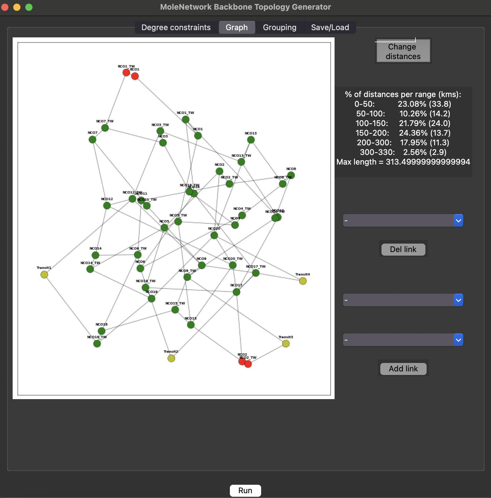
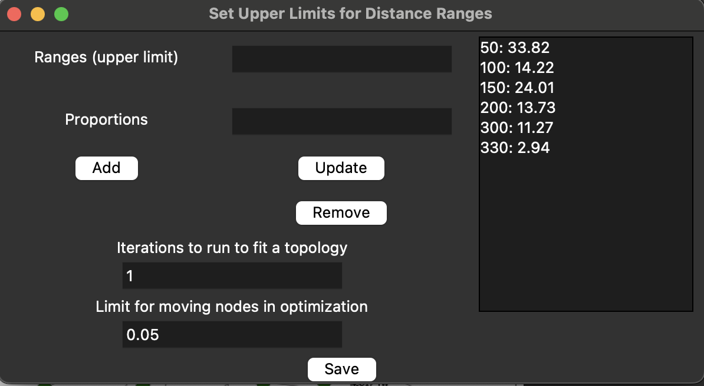
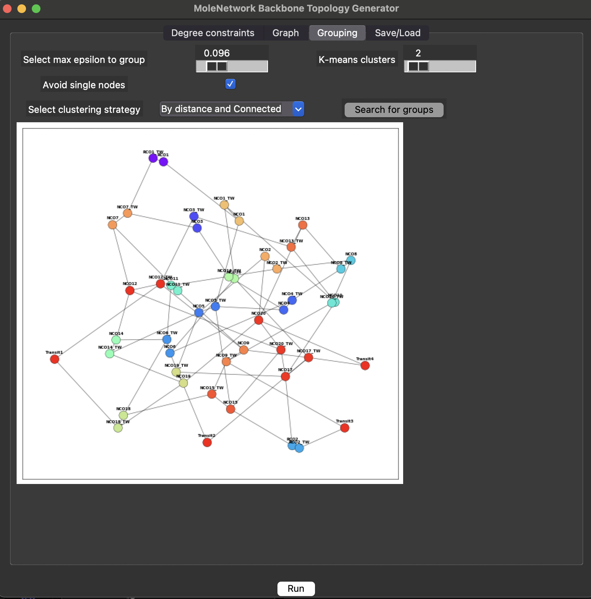
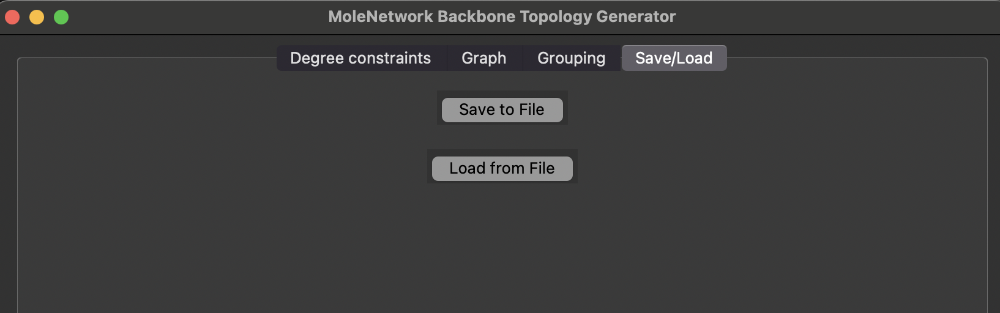

# MoleNetwork User Manual: Backbone Topology Generator

## Table of Contents
1. [Introduction](#introduction)
2. [System Requirements](#system-requirements)
3. [Installation & Setup](#installation--setup)
4. [Default Parameters & Initialization](#default-parameters-and-initialization)
4. [Application Overview](#application-overview)
5. [Step-by-Step Usage Guide](#step-by-step-usage-guide)
    - [1. Degree Constraints Tab](#1-degree-constraints-tab)
    - [2. Graph Tab](#2-graph-tab)
    - [3. Grouping Tab](#3-grouping-tab)
    - [4. Save/Load Tab](#4-saveload-tab)
6. [Example Workflow](#example-workflow)
7. [Tips & Best Practices](#tips--best-practices)
8. [Troubleshooting](#troubleshooting)

---

## Introduction

**MoleNetwork** is an open-source tool for generating synthetic optical network topologies for techno-economic studies. The tool enables users to construct realistic backbone, metro core, and metro aggregation topologies inspired by actual operator deployments.

This manual covers the **Backbone Topology Generator**, a module that allows users to define the structural properties of national or regional backbone networks, generate corresponding graphs, visually inspect/edit them, and prepare them for further metro-level topology generation.

---

## System Requirements

- Python 3.8+
- Required libraries (install via pip):
  - `networkx`
  - `matplotlib`
  - `numpy`
  - `scipy`
  - `sklearn`
  - `tkinter` (standard in many Python installations)

---

## Installation & Setup

1. Clone the MoleNetwork repository:
    ```bash
    git clone https://github.com/amacian/molenetgen.git
    cd molenetgen
    ```

2. Install dependencies:
    ```bash
    pip install -r requirements.txt
    ```

3. Run the Backbone Topology Generator:
    ```bash
    python main.py
    ```

---

## Default Parameters and Initialization

When `main.py` is executed, the Backbone Topology Generator initializes with a predefined set of parameters. These default values can be found in the script and modified if needed.

Key initial parameters include:

- **Number of Nodes**: e.g. `48`
- **Node Types Distribution**: e.g.
  - NCO (National Central Office): `40`
  - RCO (Regional Central Office): `4`
  - Transit: `4`
- **Degree Distribution**: e.g.
  - Degree 2: `9 nodes`
  - Degree 3: `18 nodes`
  - Degree 4: `15 nodes`
  - Degree 5: `4 nodes`
  - Degree 6: `2 nodes`
- **Generation Algorithm**: e.g. `Spectral`
- **Topology Generator Strategy**: e.g. `Default`
- **Node Type Assignment**: e.g. `Random`

These values populate the GUI fields upon startup and serve as a template for the user to adjust according to the study scenario.

> To modify the defaults permanently, edit the corresponding variables in `main.py`.


---

## Application Overview

The Backbone Generator consists of a GUI with the following tabs:
- **Degree Constraints**: Configure node degree distribution and types.
- **Graph**: Visualize and edit the generated network topology.
- **Grouping**: Cluster backbone nodes into metro regions.
- **Save/Load**: Save or load topology configurations to/from files.

Each tab enables parameter tuning or actions that contribute to building a realistic synthetic backbone.

---

## Step-by-Step Usage Guide

### 1. Degree Constraints Tab

This tab allows configuring the statistical structure of the topology:
- **Degrees**: Define how many nodes should have degree 2, 3, etc.
- **Node Types**: Assign proportions for:
  - NCO (National Central Offices)
  - RCO (Regional Central Offices)
  - Transit nodes

Additional controls:
- Choose layout algorithm (`spring`, `spectral`, `kamada`)
- Select generation strategy (`Default`, `Twin Nodes`, `Waxman`)
- Type assignment strategy (`random`, `degree-based`, etc.)



### 2. Graph Tab

Displays the generated network graph and statistics for link lengths.

- View node types with color coding
- See % of links per distance range (km)
- Manually add or remove links
- Click **Change distances** to open a distance range dialog



**Edit Distances Dialog:**

Set statistical targets for link length distribution, run optimization, and set movement thresholds.



### 3. Grouping Tab

Cluster the backbone nodes into metro regions using:

- **DBSCAN** (distance-based)
- **Connected DBSCAN** (includes topology links)
- **Bisecting K-means**

Set parameters like epsilon (radius), number of clusters, and whether to allow isolated nodes.



### 4. Save/Load Tab

Save the generated topology (nodes, edges, clusters) to an Excel file, or load a previously saved one.



---

## Example Workflow

1. Set degree distribution: e.g., 20% of nodes with degree 3, 30% with degree 4, etc.
2. Define node type percentages: e.g., 80% NCO, 10% RCO, 10% Transit.
3. Choose the `Spectral` layout and `Default` generator.
4. Press **Run** to generate the topology.
5. Review the graph in the **Graph** tab. Optionally edit links or ranges.
6. Go to **Grouping**, cluster nodes with DBSCAN (`eps=0.03`).
7. Save the result via the **Save/Load** tab.

---

## Tips & Best Practices

- Start with known statistics (e.g., from TIM or Telefónica) to match real topologies.
- Run multiple iterations to reduce MAPE on distance stats.
- Use clustering to define metro regions for downstream modules.

---

## Troubleshooting

| Issue | Solution |
|-------|----------|
| GUI doesn't launch | Ensure `tkinter` is installed and available |
| Stats don’t match expectations | Increase iteration count or adjust ranges |

---

---

## Related Modules

- [→ Metro Core Topology Generator Manual](./MoleNetwork_MetroCore_User_Manual.md) 

---
