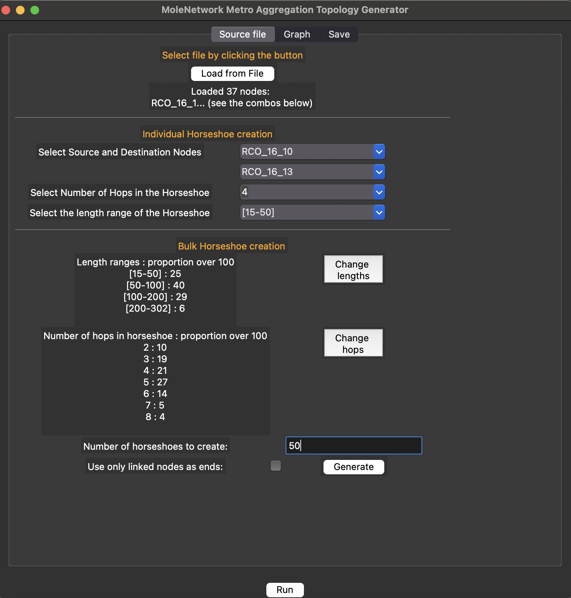
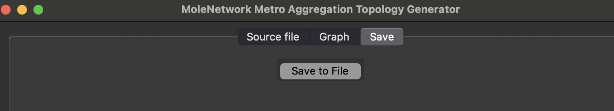

---

# MoleNetwork User Manual: Metro Aggregation Topology Generator

## Table of Contents

1. [Introduction](#introduction)
2. [Default Parameters and Initialization](#default-parameters-and-initialization)
3. [Application Overview](#application-overview)
4. [Step-by-Step Usage Guide](#step-by-step-usage-guide)
    - [1. Source File Tab](#1-source-file-tab)
    - [2. Graph Tab](#2-graph-tab)
    - [3. Save Tab](#3-save-tab)
5. [Example Workflow](#example-workflow)
6. [Notes & Tips](#notes--tips)

---

## Introduction

The **Metro Aggregation Topology Generator** module of MoleNetwork enables the creation of aggregation-layer connections within metro networks. These are typically modeled using "horseshoe" paths between RCO nodes or other metro nodes.

This module is used after metro core clusters have been generated and exported. It supports both individual and bulk generation of aggregation paths with constraints on path length and hop count.

---

## Default Parameters and Initialization

Upon launching `mainMetroAggregation.py`, the application sets several defaults which users can override through the GUI.

### Key Initial Parameters:

- **Number of Horseshoes to Create**: e.g. `50`
- **Use Only Linked Nodes as Ends**: e.g. `False` (unchecked by default)
- **Length Ranges (km)**: e.g.
  - \[15–50]: `25%`
  - \[50–100]: `40%`
  - \[100–200]: `29%`
  - \[200–302]: `6%`
- **Number of Hops in Horseshoe**: e.g.
  - 2 hops: `10%`
  - 3 hops: `19%`
  - 4 hops: `21%`
  - 5 hops: `27%`
  - 6 hops: `14%`
  - 7 hops: `5%`
  - 8 hops: `4%`

To change these defaults programmatically, modify the variable definitions in `mainMetroAggregation.py` or `MetroAggGenApp.py`.

---

## Application Overview

The GUI contains three main tabs:

- **Source File**: Load node list and set parameters for individual or bulk horseshoe creation.
- **Graph**: Visualize generated horseshoes (not shown here; appears when single horseshoes are created).
- **Save**: Export the generated topology.

---

## Step-by-Step Usage Guide

### 1. Source File Tab

This is where users load the node list and define horseshoe generation rules.

**Features:**

- **Load from File**: Select a `.txt` or `.json` node list exported from metro core generation.
- **Individual Horseshoe**:
  - Select source and destination nodes
  - Number of hops (e.g., 4)
  - Length range (e.g., [15–50] km)
- **Bulk Horseshoe Creation**:
  - Define hop distribution
  - Define length range proportions
  - Set number of horseshoes to create (e.g., 50)
  - Toggle “only linked nodes” to restrict sources/targets to preconnected nodes

---

### 2. Graph Tab

Displays generated horseshoes only when a **single** horseshoe is generated (individual mode). No image shown here due to bulk-only generation in this use case.

---

### 3. Save Tab

Allows saving the generated aggregation paths to file for reuse or simulation input.

---

## Example Workflow

1. Load a list of metro nodes from the previous stage.
2. Configure bulk generation with:
   - 50 horseshoes
   - Path length and hop distribution as desired
3. Press **Generate**.
4. View horseshoes (only if generated one-by-one).
5. Save results using the **Save to File** button.

---

## Notes & Tips

- "Horseshoe" paths are defined as open paths with a controllable number of hops and length.
- Use hop count and length range together to model physical-layer realism.
- For visualization, try generating a few horseshoes individually before full batch runs.
- Generated paths can be merged with metro core graphs for full metro layouts.

---

## Related Modules

- [← Metro Core Topology Generator Manual](./MoleNetwork_MetroCore_User_Manual.md)

---
