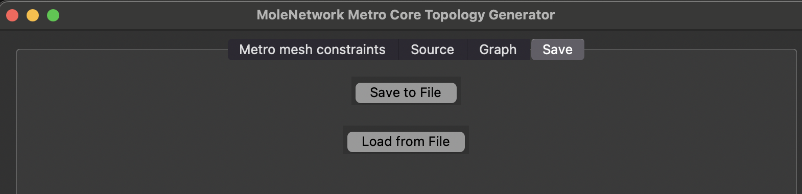

---

# MoleNetwork User Manual: Metro Core Topology Generator

## Table of Contents

1. [Introduction](#introduction)
2. [Default Parameters and Initialization](#default-parameters-and-initialization)
3. [Application Overview](#application-overview)
4. [Step-by-Step Usage Guide](#step-by-step-usage-guide)
    - [1. Metro Mesh Constraints Tab](#1-metro-mesh-constraints-tab)
    - [2. Source Tab](#2-source-tab)
    - [3. Graph Tab](#3-graph-tab)
    - [4. Save Tab](#4-save-tab)
5. [Example Workflow](#example-workflow)
6. [Notes & Tips](#notes--tips)

## Introduction

The **Metro Core Topology Generator** module of MoleNetwork allows users to create realistic metro-level optical core networks based on clustered backbone nodes. These metro core networks typically connect multiple central offices (NCOs/RCOs) in urban or regional areas using mesh or ring topologies.

This module is intended to operate after backbone clustering is completed and exported from the Backbone Generator.

--- 

## Default Parameters and Initialization

When `mainMetroCore.py` is launched, the Metro Core Topology Generator initializes with default parameters that control node distribution, topology shape, and layout strategy.

### Key Initial Values:

- **Number of Nodes**: e.g. `17`
- **Node Type Distribution**: e.g. 
  - DC (Data Center): `1`
  - NCO: `5`
  - RCO: `66`
  - RCOh (Regional CO hosting): `23`
- **Degree Distribution**: e.g.
  - Degree 2: `53 nodes`
  - Degree 3: `27 nodes`
  - Degree 4: `12 nodes`
  - Degree 5: `5 nodes`
  - Degree 6: `2 nodes`
- **Layout Algorithm**: e.g. `spectral`
- **Node Type Assignment**: e.g. `betweenness`
- **Distance Range Defaults (km)**: e.g.
  - 10: `39%`
  - 40: `37%`
  - 80: `21%`
  - 120: `4%`
- **Optimization Controls**: 
  - Iterations: e.g. `1`
  - Max node movement: e.g. `0.1`

These parameters populate the GUI at startup and can be edited via the interface. To modify the defaults programmatically, edit the initialization section in `mainMetroCore.py` or `MetroGenApp.py`.

---

## Application Overview

The GUI of the Metro Core Generator is divided into four main tabs:

- **Metro Mesh Constraints**: Define statistical rules for degrees, node types, and mesh layout generation.
- **Source**: Select input cluster (from file or list of nodes) for metro generation.
- **Graph**: Visualize and adjust the metro mesh layout.
- **Save**: Export generated topologies.

---

## Step-by-Step Usage Guide

### 1. Metro Mesh Constraints Tab

Configure structural properties for the metro topology:

- **Degree Distribution**: Number of nodes by degree (e.g., 2, 3, 4…)
- **Node Type Distribution**:
  - DC (Data Center)
  - NCO (National Central Office)
  - RCO (Regional Central Office)
  - RCOnh (Regional no hub for aggregation)
- **Layout Algorithm**: e.g., `spectral`, `spring`
- **Type Assignment**: Based on `random`, `betweenness`, or others

---

### 2. Source Tab

Specify the input nodes that make up the metro region. This can be done in two ways:

- **Set of Nodes**: Manually add node names
- **File**: Load a cluster definition from a file with predefined groups

The selected cluster appears in the central list and can be used to generate a topology. Options:
- Number of rings (for ring-based layouts, only for clusters with just 2 nodes).
- Mesh constraints (taken from the previous defined tab).

**Source – Set of Nodes:**

**Source – From File:**

---

### 3. Graph Tab

Displays the generated metro graph. Includes:
- Node roles (colored)
- Link visualization
- Distance histogram per link range
- Edit distances via `Change distances` button

**Edit Distance Dialog:**

Specify distance ranges and proportion targets, plus fine-tune with:
- Number of optimization iterations
- Max movement threshold

---

### 4. Save Tab

Use this tab to save or load metro topology configurations.

- **Save to File**: Export current metro topology
- **Load from File**: Reuse a saved metro layout for review or editing

---

## Example Workflow

1. Load cluster from file or enter NCO/RCO node names manually.
2. Go to **Metro Mesh Constraints**:
    - Set degrees (e.g., majority of nodes with degree 3)
    - Set node types (e.g., 1 DC, 5 NCO, 4 RCO)
    - Choose layout algorithm (`spectral`)
3. Press **Run** to generate.
4. Check distances and structure in **Graph**.
5. Optionally, refine layout via distance dialog.
6. Save topology using the **Save** tab.

---

## Notes & Tips

- Ensure node names are consistent with those in the backbone output.
- Use `betweenness` assignment for a more hierarchical metro role structure.
- Only clusters with 2 can define ring structures.
- Tune the number of rings when required.

---

---

## Related Modules

- [← Backbone Topology Generator Manual](./MoleNetwork_Backbone_User_Manual.md)
- [→ Metro Aggregation Topology Generator Manual](./MoleNetwork_MetroAggregation_User_Manual.md)

---
